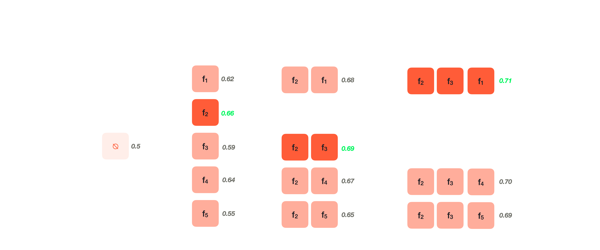

# Sequential forward selection (SFS)

It is a greedy iterative feature selection algorithm that starts with an empty feature set and sequentially adds features that maximize the quality of the model. Each new feature is added only if it improves the quality of the model according to a given metric.



```
SequentialFeatureSelection:
  Set included to {}
  Set excluded to {1, 2, 3, ..., N}

  For each i in range(max_features):
    Do OptimizationStep

  Return included


OptimizationStep:
  For each feature k in excluded:
    Evaluate included + {k}
    Save k's score

  Take k with the highest score
  Add k to included
  Remove k from excluded

  Return included and excluded
  ```

There is also a reverse sequential backward selection (SBS) algorithm in which features are sequentially removed.

# Baseline Model

We will work with a synthetic dataset and solve a regression task. As the ML algorithm, we use linear regression. The metric of choice is the coefficient of determination \( R^2 \).

The dataset mentioned below consists of 50-100 features. Only five of them are useful. The rest of the features are noise. We do not know which features are useful and which are not, as well as how many features there are.

We use a 3x10 cross-validation scheme (we split the dataset into three folds and repeat this operation 10 times with different `random_state`). This particular advantage of such a validation scheme before the usual single splitting into training and test sets is that it allows us to reliably evaluate the model, avoiding the randomness of a single split.


When creating the class, it accepts the following arguments:

- `model` — the model (in our case, `LinearRegression`, but it can be any other algorithm);
- `cv` — cross-validation scheme (in our case, it's an instance of the class `RepeatedKFold`);
- `max_features` — the maximum number of features to select;
- `verbose` — silent (0) or verbose (>1) execution. It's not a mandatory parameter, but it's highly recommended to implement it using the `tqdm` module for a progress bar during execution.

The class has two methods:

- `fit` — accepts a dataset with features `X` and targets `y`. It selects features and saves them to the class attribute `selected_features_`.
- `transform` — accepts a dataset `X` and returns it, only with the selected features `selected_features_`.

Class attributes:

- `n_features_` — the original number of features in the dataset `X`, which is passed to the `fit` method;
- `selected_features_` — features selected during the execution of the `fit` method;
- `n_selected_features_` — the number of selected features. Implement it as a property with the `@property` decorator.


